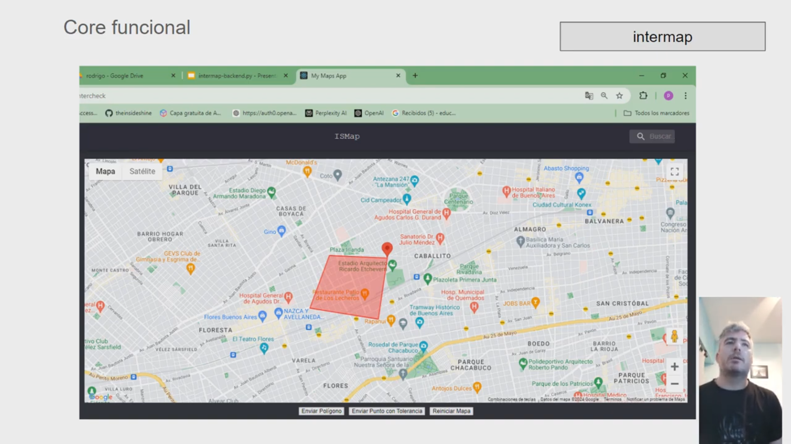
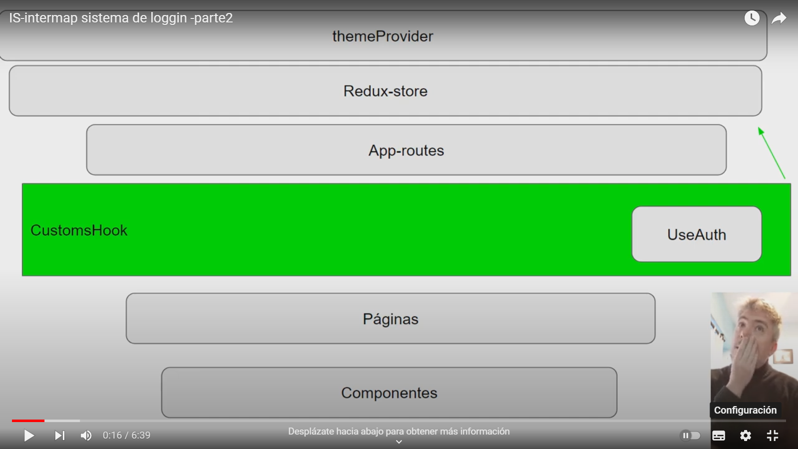
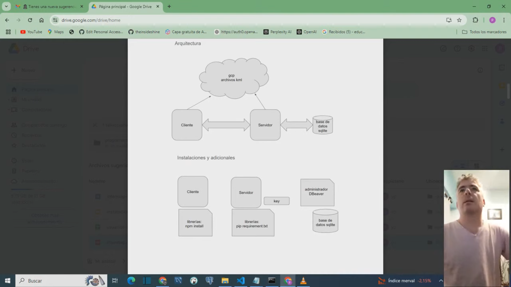

App to detect geographic interference

The intention of the project is to be able to test the concept of an app that, when entering a position on the map, determines if it interferes with a network of high-tension power cables.

Systematize an existing process, using current tools, geolocation, cloud for reactivity and AI for incorrect entries. Generating the information to enter SAP.

Core

Login

Demo1

Home Page 

Backend-Python : https://github.com/theinsideshine/is-intermap-back 

