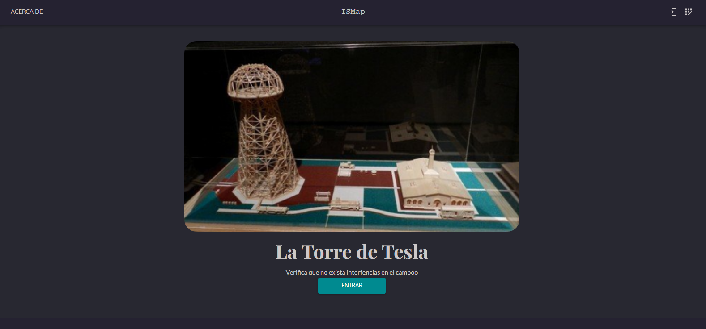

About ISMap

ISMap is an application designed to detect geographic interferences that may impact various areas. The project combines data visualization with anomaly analysis, focusing on potential interferences that could affect communication and system operations. 

The goal of ISMap is to develop a prototype capable of identifying whether a specific location on the map interferes with high-voltage power lines. To achieve this, it utilizes advanced tools such as geolocation, cloud services for fast responsiveness, and artificial intelligence to correct errors in the input data. Additionally, the information generated by the app can be seamlessly integrated into systems like SAP, providing a comprehensive and efficient solution.

Core

Login

Demo1

Home Page 

About Page 

Interference List

Interference Id

Interference Save

Backend-Python : https://github.com/theinsideshine/is-intermap-back 

